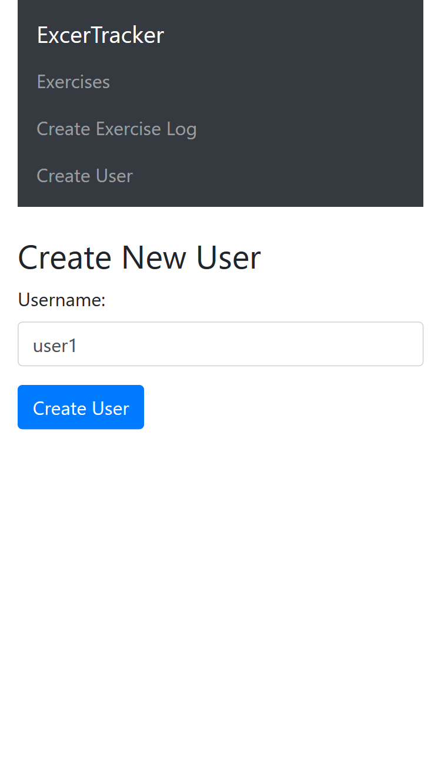
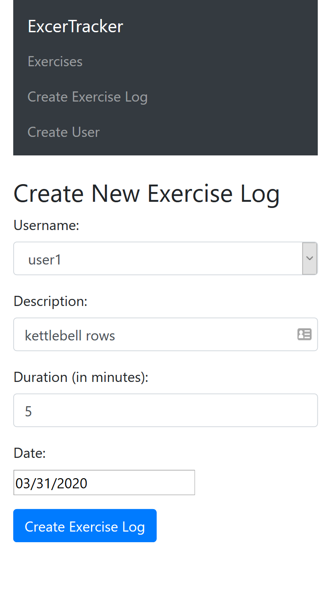
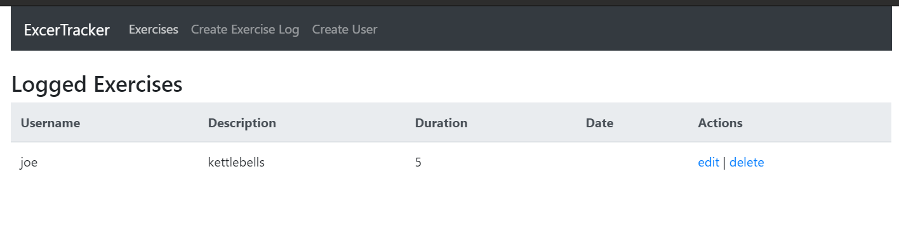

This project was bootstrapped with [Create React App](https://github.com/facebook/create-react-app).

This project is based on [this project](https://github.com/beaucarnes/mern-exercise-tracker-mongodb) offered at FreeCodeCamp. 

## Summary

This is a very simple full-stack project based on the MERN stack. This is an exercise tracking project. Users can be added, their exercises can be tracked by adding the workout name, description, and date performed. The exercises can be modified or deleted.

 The project uses the free tier of MongoDB Atlas, which is a MongoDB server hosted on the cloud, Express.js on the backend for routing and creating models, React.js to build the front-end, and a Node.js runtime.

## Screenshots

## Available Scripts
In the project directory, you can run to get the fron-end running:

### `npm start`

Runs the app in the development mode. 
Open [http://localhost:3000](http://localhost:3000) to view it in the browser.

The page will reload if you make edits. 

### Backend Server
Go to the backend folder and run 
### `nodemon server`
This assumes that nodemon is installed. To setup the backend, create a directory. Then install the packages _axios, react-router-dom, react-datepicker_.

### `npm run build`

Builds the app for production to the `build` folder. 
It correctly bundles React in production mode and optimizes the build for the best performance.

The build is minified and the filenames include the hashes. 
Your app is ready to be deployed!

See the section about [deployment](https://facebook.github.io/create-react-app/docs/deployment) for more information.

### `npm run eject`

**Note: this is a one-way operation. Once you `eject`, you can’t go back!**

If you aren’t satisfied with the build tool and configuration choices, you can `eject` at any time. This command will remove the single build dependency from your project.

Instead, it will copy all the configuration files and the transitive dependencies (webpack, Babel, ESLint, etc) right into your project so you have full control over them. All of the commands except `eject` will still work, but they will point to the copied scripts so you can tweak them. At this point you’re on your own.

You don’t have to ever use `eject`. The curated feature set is suitable for small and middle deployments, and you shouldn’t feel obligated to use this feature. However we understand that this tool wouldn’t be useful if you couldn’t customize it when you are ready for it.
